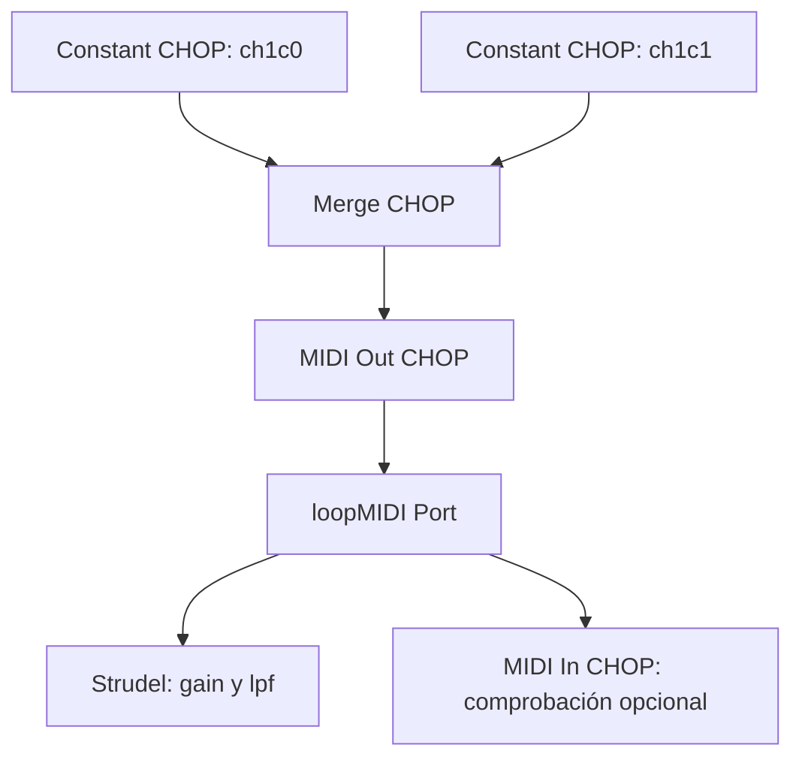

# TouchDesigner → Strudel mediante MIDI

Controla el sonido de **Strudel** desde **TouchDesigner** mediante mensajes MIDI **Control Change (CC)**. Esta prueba utiliza dos controles: uno para la ganancia y otro para la frecuencia de corte de un filtro pasa bajos.

Ambas aplicaciones se ejecutan en el **mismo computador Windows** y se comunican a través de un puerto virtual creado con **loopMIDI**. El audio se genera en Strudel; MIDI transporta los valores de control.

## Correspondencia de controles

| Canal CHOP en TouchDesigner | Canal MIDI | Control Change | Lectura en Strudel | Parámetro |
| --- | --- | --- | --- | --- |
| `ch1c0` | 1 | CC 0 | `midi(0, 1)` | Ganancia: `gain`, de 0 a 1 |
| `ch1c1` | 1 | CC 1 | `midi(1, 1)` | Filtro: `lpf`, de 100 a 5000 Hz |

En este proyecto, `ch1c0` significa: prefijo `ch`, canal MIDI `1`, controlador `c` e índice `0`. Estos nombres permiten que el `MIDI Out CHOP` identifique qué mensaje debe enviar.

**Tres números distintos:** el `Device ID` identifica una entrada del mapper de TouchDesigner; el canal MIDI identifica uno de los 16 canales del protocolo; el número de CC identifica el controlador. Que el Device ID y el canal MIDI sean ambos `1` en esta prueba es una elección de configuración.

## Requisitos

| Herramienta | Función |
| --- | --- |
| [TouchDesigner](https://derivative.ca/) | Generar y enviar los valores de control |
| [loopMIDI](https://www.tobias-erichsen.de/software/loopmidi.html) | Crear el puerto MIDI virtual en Windows |
| [Strudel](https://strudel.cc/) | Recibir los controles y generar el audio |
| Navegador compatible con Web MIDI, como Chrome o Edge | Ejecutar Strudel y permitir el acceso a MIDI |

Abre loopMIDI y crea el puerto antes de iniciar TouchDesigner y Strudel. Mantén loopMIDI abierto durante la prueba y acepta el permiso de acceso a MIDI si el navegador lo solicita.

## 1. Crear el puerto virtual

En loopMIDI, crea un puerto llamado exactamente **`loopMIDI Port`**. Este nombre debe coincidir con el utilizado en TouchDesigner y en el código de Strudel.


## 2. Configurar el MIDI Device Mapper

En TouchDesigner, abre **Dialogs → MIDI Device Mapper** y añade un `Device Mapping` con estos valores:

| Campo | Valor |
| --- | --- |
| ID | `1` |
| In Device | `loopMIDI Port` |
| Out Device | `loopMIDI Port` |
| MIDI Map | `none` |
| Channel | `1` |


Los operadores MIDI usarán la tabla **`/local/midi/device`** y el **Device ID `1`** para localizar el puerto. Así puedes cambiar el dispositivo desde el mapper sin editar cada operador.

El `In Device` se configura para comprobar los mensajes con un `MIDI In CHOP`. El envío hacia Strudel utiliza el `Out Device`.

## 3. Construir la red de TouchDesigner

Crea dos `Constant CHOP`, cada uno con un canal:

| Operador | Nombre del canal | Valor inicial |
| --- | --- | --- |
| Constant CHOP A | `ch1c0` | `0.42` |
| Constant CHOP B | `ch1c1` | `0.39` |

Conecta ambos a un `Merge CHOP` y conecta su salida a un `MIDI Out CHOP`.



### MIDI Out CHOP

| Página | Parámetro | Valor |
| --- | --- | --- |
| Dest | Active | `On` |
| Dest | MIDI Destination | `Device` |
| Dest | Device Table | `/local/midi/device` |
| Dest | Device ID | `1` |
| Dest | One Based Index / 1 Based Index | `Off` |
| Dest | Channel Prefix | `ch` |
| Dest | Cook Every Frame | `On` |
| Control | Controller Name | `c` |
| Control | Controller Format | `7 bit Controllers` |
| Control | Normalize | `0 to 1` |


**La normalización se configura en la página Control.** Con `Normalize = 0 to 1`, TouchDesigner convierte los valores de entrada al rango MIDI de 7 bits, de `0` a `127`.

`1 Based Index = Off` hace que el índice del nombre coincida con el número de CC: `c0` envía CC 0 y `c1` envía CC 1. Los canales MIDI siguen numerados del **1 al 16**; para este ejemplo se utiliza `ch1`.

Mantén la reproducción de TouchDesigner activa. El `MIDI Out CHOP` envía mensajes cuando cambian sus valores de entrada.

## 4. Recibir los controles en Strudel

Abre Strudel, pega este código y ejecútalo:

```javascript
setcpm(100)

const midi = await midin('loopMIDI Port')

const cc0 = midi(0, 1) // CC 0, canal MIDI 1
const cc1 = midi(1, 1) // CC 1, canal MIDI 1

$: note("c3 e3 g3 c4")
  .sound("sawtooth")
  .legato(1)
  .lpf(cc1.range(100, 5000))
  .gain(cc0)
```

`midin(...)` abre la entrada MIDI y devuelve una función para consultar los controles. Sus argumentos se escriben en el orden **`midi(cc, channel)`**:

- `midi(0, 1)` lee CC 0 del canal MIDI 1 y controla la ganancia.
- `midi(1, 1)` lee CC 1 del canal MIDI 1; `.range(100, 5000)` transforma su valor normalizado en una frecuencia de corte.

Especificar el canal evita mezclar el mismo número de CC enviado por distintos canales MIDI.

## 5. Probar la comunicación

Con Strudel ejecutándose, modifica los valores de los `Constant CHOP`:

1. Lleva `ch1c0` a `0` y después a `0.42`: debes escuchar que la secuencia se silencia y vuelve a sonar.
2. Mantén `ch1c0` por encima de `0` y mueve `ch1c1` entre `0` y `1`: el filtro debe pasar de 100 a 5000 Hz y el sonido debe volverse más brillante.

**Mueve ambos controles después de iniciar Strudel.** Esto genera mensajes nuevos y permite comprobar la recepción aunque los valores iniciales se hubieran enviado antes de abrir la entrada MIDI.

### Comprobación opcional con MIDI In CHOP

Crea un `MIDI In CHOP` que escuche el mismo puerto:

| Parámetro | Valor |
| --- | --- |
| Active | `On` |
| Mode | `Automatic` |
| MIDI Source | `Device` |
| Device Table | `/local/midi/device` |
| Device ID | `1` |
| 1 Based Index | `Off` |
| Controller Format | `7 bit Controllers` |


En la configuración de la captura, los canales recibidos se llaman `ch1ctrl0` y `ch1ctrl1`. Sus nombres pueden variar según el modo de salida y la configuración de nombres del operador; lo que debes comprobar es el canal MIDI, el número de CC y el valor recibido.

Para observar valores enteros de `0` a `127`, utiliza `Normalize = None` en la página **Control**, cuando el modo de salida permita configurar ese parámetro. Con normalización de `0 to 1`, verás valores entre `0` y `1`.

| Valor enviado desde TouchDesigner | Valor MIDI aproximado | Valor normalizado recibido en Strudel |
| --- | --- | --- |
| `0` | `0` | `0` |
| `0.42` | `53` | `0.417` |
| `0.39` | `50` | `0.394` |
| `1` | `127` | `1` |

Los valores intermedios son aproximados porque MIDI de 7 bits ofrece **128 niveles**. Un mensaje como **canal 1, CC 0, valor 53** significa que ese controlador tiene ahora el valor 53.

El `MIDI In CHOP` permite observar los mensajes que TouchDesigner envía por loopMIDI. No necesita conectarse al `MIDI Out CHOP` para realizar esta comprobación.

## 6. Guardar y abrir el proyecto en otro computador

Guarda el archivo `.toe` después de configurar la red y el mapper.


| Elemento | Dónde se conserva |
| --- | --- |
| Red de operadores y parámetros MIDI | Proyecto `.toe` |
| Tabla de dispositivos: `/local/midi/device` | Proyecto `.toe` |
| User Maps personalizados, si se crean: `/local/midi/userdevices` | Proyecto `.toe` |
| Puerto virtual `loopMIDI Port` | loopMIDI, fuera del `.toe` |
| Código de Strudel | Debe guardarse por separado |

**Device Mapping y User Map son configuraciones distintas.** El primero asocia un Device ID con los dispositivos de entrada y salida. Un User Map define un mapeo personalizado de controles. Esta prueba utiliza `MIDI Map = none` y nombres explícitos como `ch1c0`, por lo que no requiere crear un User Map.

Para repetir la prueba en otro computador Windows:

1. Instala y abre loopMIDI.
2. Crea el puerto `loopMIDI Port`.
3. Abre el `.toe` y verifica los dispositivos asociados al ID `1` en el mapper.
4. Abre Strudel y ejecuta el código.
5. Modifica ambos controles para enviar sus valores.

## Solución de problemas

| Síntoma | Qué revisar |
| --- | --- |
| El puerto no aparece en TouchDesigner | Comprueba que loopMIDI esté abierto y que el puerto exista. Si lo creaste después de abrir TouchDesigner, guarda el proyecto y reinicia TouchDesigner. |
| Strudel no encuentra la entrada MIDI | Comprueba el nombre exacto del puerto y el permiso MIDI del navegador. Recarga Strudel si creaste el puerto después de abrirlo. |
| No llegan mensajes | Revisa `Active`, `Cook Every Frame`, la reproducción de TouchDesigner, el Device ID y los nombres `ch1c0` y `ch1c1`. Modifica los valores para generar mensajes nuevos. |
| Los valores no corresponden al rango esperado | Revisa `Normalize` en la página Control: `0 to 1` en MIDI Out; `None` en MIDI In si quieres observar valores enteros. |
| Se recibe un número de CC distinto | Comprueba que `1 Based Index` esté en `Off` en ambos operadores. |
| Llegan mensajes, pero no hay sonido | Comprueba que Strudel esté reproduciendo, que `ch1c0` sea mayor que `0` y que la salida de audio esté disponible. |

## Referencias

- [MIDI Out CHOP — Derivative](https://derivative.ca/UserGuide/MIDI_Out_CHOP)
- [MIDI In CHOP — Derivative](https://derivative.ca/UserGuide/MIDI_In_CHOP)
- [MIDI Mapper Dialog — Derivative](https://derivative.ca/UserGuide/MIDI_Mapper_Dialog)
- [Entrada y salida MIDI — Strudel](https://strudel.cc/learn/input-output/)
- [loopMIDI — Tobias Erichsen](https://www.tobias-erichsen.de/software/loopmidi.html)
